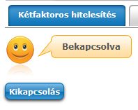
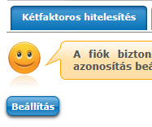
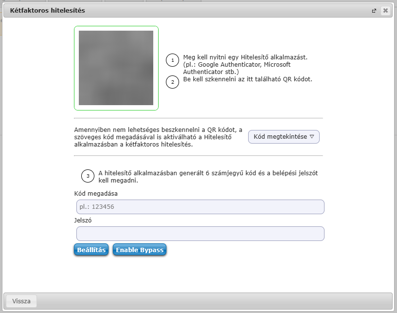
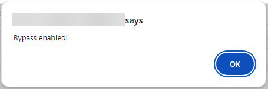
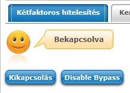

# no2fa [](https://github.com/MrExplode/no2fa/actions/workflows/check.yml)

[English description](https://github.com/MrExplode/no2fa/blob/6039c3edd50082ae893ffc4e33097577c37f4021/README.md)

Ez az userscript "kikerüli" a 2 faktoros hitelesítést a Neptunban.  
Igen, működik a [Neptun PowerUp](https://github.com/solymosi/npu)-al.

**Mire való ez, miért jó?**  
Egyre több intézményben kötelező a Neptunban kétfaktoros hitelesítést használni, ugyanakkor a Neptun által biztosított rendszer alsóhangon nem felhasználóbarát.  
Unod már minden egyes alkalommal újra és újra beírni a kódot? Miért nem lehet megjegyeztetni az eszközt?  
A **no2fa** script átveszi ezt a feladatot helyetted, minden bejelentkezésnél automatikusan átugorja a kétfaktoros hitelesítés ablakját.

> [!NOTE]  
> Jelenleg egyszerre csak egy gépen lehet használni.

<details>
<summary>Hogy működik?</summary>
A script lementi a 2fa beállításakor a TOTP secret keyt, majd bejelentkezéskor kiszámolja az aktuális kódot, beírja a mezőbe és rákattint a bejelentkezés gombra.<br>
Ezzel felhasználói élmény szempontjából "kikerültük" a 2fa-t.
</details>

## Telepítés
1. Telepítsd a  [**TamperMonkey**](https://www.tampermonkey.net/)-t
2. Telepítsd a scriptet [ide](https://github.com/MrExplode/no2fa/releases/latest/download/no2fa.user.js) kattintva
3. Kattints a **Telepítés** (vagy **Install**) gombra a *TamperMonkey* oldalán (amire az előző lépés végrehajtásakor kerültél)

A script telepítésével elfogadod a *License*-t.  
> Lásd: [itt](#licensing), lényegében nem adok garanciát semmire és nem vállalok felelősséget semmiért.

## Használat
0. Telepítsd a scriptet ha nem tetted meg (remélem ez evidens!!)

1. Navigálj ide: `Saját adatok > Beállítások > Kétfaktoros hitelesítés`

2. Kattints a **Kikapcsolás** gombra (ha még nem kapcsoltad be, vagy már kikapcsoltad valamiért, akkor ugorj a következő pontra)  


3. Kattints a **Beállítás** gombra  


4. Kattints az **Enable Bypass** gombra.  


5. Okézd le a felugró visszaigazolást.  


6. **NINCS VÉGE, NE ZÁRD BE AZ ABLAKOT!!**
7. Követsd a *Kétfaktoros hitelesítés* ablakban látható utasításokat.
8. Ha megcsináltál mindent (QR kód, kód beírása, jelszó), kattints a **Beállítás** gombra.
9. Ellenőrzésképpen frissítsd újra az oldalt (és ha nem a *Kétfaktoros hitelesítés* az első elem a beállítások közt, navigálj rá)  
A következőt kell látnod:  


10. A következő bejelentkezésnél már nem kell beírnod a kódot.

## Development
This project is built with [Vite](https://vitejs.dev/) using [pnpm](https://pnpm.io/).   

---
Install the dependencies:
```bash
pnpm install
```
Start development server:  
(This will start the Vite dev server, and install a bridge userscript that allows hot reloading)
```bash
pnpm run dev
```
Building the production release:
```bash
pnpm run build
```

## Licensing
```
MIT License

Copyright (c) 2024 SunStorm

Permission is hereby granted, free of charge, to any person obtaining a copy
of this software and associated documentation files (the "Software"), to deal
in the Software without restriction, including without limitation the rights
to use, copy, modify, merge, publish, distribute, sublicense, and/or sell
copies of the Software, and to permit persons to whom the Software is
furnished to do so, subject to the following conditions:

The above copyright notice and this permission notice shall be included in all
copies or substantial portions of the Software.

THE SOFTWARE IS PROVIDED "AS IS", WITHOUT WARRANTY OF ANY KIND, EXPRESS OR
IMPLIED, INCLUDING BUT NOT LIMITED TO THE WARRANTIES OF MERCHANTABILITY,
FITNESS FOR A PARTICULAR PURPOSE AND NONINFRINGEMENT. IN NO EVENT SHALL THE
AUTHORS OR COPYRIGHT HOLDERS BE LIABLE FOR ANY CLAIM, DAMAGES OR OTHER
LIABILITY, WHETHER IN AN ACTION OF CONTRACT, TORT OR OTHERWISE, ARISING FROM,
OUT OF OR IN CONNECTION WITH THE SOFTWARE OR THE USE OR OTHER DEALINGS IN THE
SOFTWARE.
```